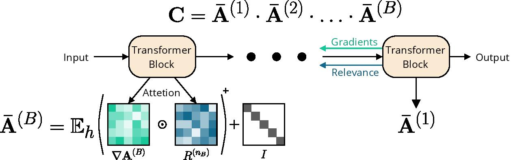

# Transformer Attribution Reimplementation
This repo is a reimplementation of the code from [Pytorch Implementation](https://github.com/hila-chefer/Transformer-Explainability) of the paper titled [Transformer Interpretability Beyond Attention Visualization](https://arxiv.org/pdf/2012.09838) on ViT transformers. 

The main file is the [Explainability](Explainabiliy.ipynb) notebook in the repo. It contains sample code for visualizing attention. 

## Introduction 

The researchers propose a novel method of visualizing classifications made by a Transformer based model for both vision and NLP tasks. This method also allows to visualize explanations per class. 
