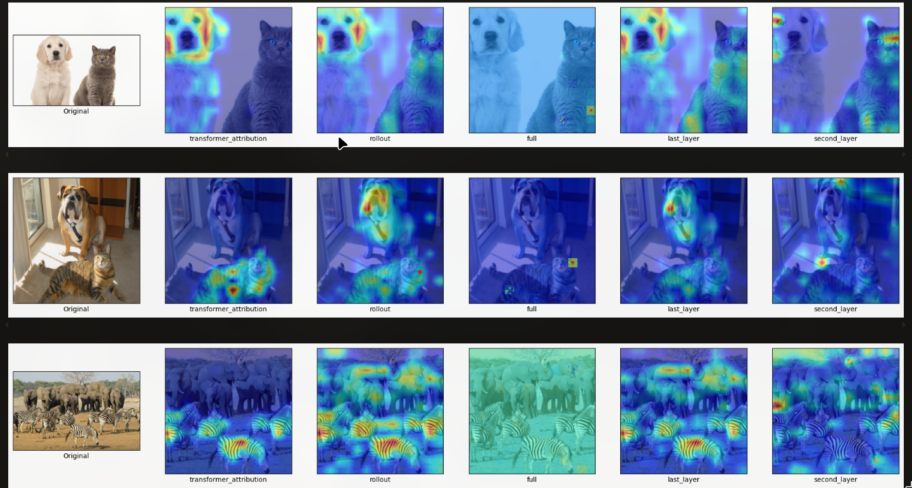

# Transformer Attribution Reimplementation
This repo is a reimplementation of the code from [Pytorch Implementation](https://github.com/hila-chefer/Transformer-Explainability) of the paper titled [Transformer Interpretability Beyond Attention Visualization](https://arxiv.org/pdf/2012.09838) on ViT transformers. 

The main file is the [Explainability](Explainabiliy.ipynb) notebook in the repo. It contains sample code for visualizing attention. 

## Introduction 

The researchers propose a novel method of visualizing classifications made by a Transformer based model for both vision and NLP tasks. This method also allows to visualize explanations per class. 


The method contains of 3 steps:
1. Calculating relevance for each attention matrix using a novel formulation of LRP.
2. Backpropagation of gradients for each attention matrix w.r.t. the visualized class. Gradients are used to average attention heads.
3. Layer aggregation with rollout. The final result is a heatmap that can be masked over the original image for a representation of attention visualization. 

## Methodology
The relevance propagation method requires creating custom pytorch modules that inherit from nn.Modules as well as a class containing a method called `relprop()`. This method can be overriden for unique classes such as MLP, Attn, Skip connections and convolutions according to the propagation procedure described in the paper. 

```python 
class RelProp(nn.Module):
    def __init__(self) -> None:
        super().__init__()
        self.register_forward_hook(forward_hook)

    # S is upstream gradient flow wrt to Z. Z is a function of X
    # C is gradient flow wrt to X now. 
    def gradprop(self, Z, X, S):
        C = torch.autograd.grad(Z,X,S, retain_graph=True)
        return C

    # Forwards and does nothing
    def relprop(self, R, alpha):
        return R

class RelPropSimple(RelProp):
    # General Deep Taylor Decomposition
    def relprop(self, R, alpha):
        Z = self.forward(self.X)
        S = safe_divide(R, Z)
        C = self.gradprop(Z, self.X, S)
        
        if torch.is_tensor(self.X) == False:
            outputs = []
            outputs.append(self.X[0] * C[0])
            outputs.append(self.X[1] * C[1])
        else:
            outputs = self.X * (C[0])
        return outputs
```
This gradient propagation is similar to GradCam methods and `relprop` itself follows the principles of General Deep Taylor Decomposition. During relpropagation of the entire model, these methods can be called in reverse order of the computational graph and the attentions can be stored for later retrieval


For example in the Final network architecture, 
```python 
def relprop(self, cam=None, method="transformer_attribution", start_layer=0, **kwargs):
    # architecture: 
    # block -> ... -> block -> norm -> pool -> head -> prediction
    cam = self.head.relprop(cam, **kwargs)
    cam = self.pool.relprop(cam, **kwargs)
    cam = self.norm.relprop(cam, **kwargs)
    # Propagate and store in reverse
    for blk in reversed(self.blocks):
        cam = blk.relprop(cam, **kwargs)
    
    if method == "transformer_attribution":
        cams = []
        # extract stored gradients and generate attention maps
        for blk in self.blocks:
            grad = blk.attn.get_attn_gradients()
            cam = blk.attn.get_attn_cam()
            cam = cam[0].reshape(-1, cam.shape[-1], cam.shape[-1])
            grad = grad[0].reshape(-1, grad.shape[-1], grad.shape[-1])
            cam = grad * cam 
            cam = cam.clamp(min=0).mean(dim=0)
            cams.append(cam.unsqueeze(0))
        # compute rollout on these maps to get final output
        rollout = compute_rollout_attention(cams, start_layer=start_layer)
        cam = rollout[:, 0, 1:]
        return cam
```

## Results 
This method is compared against different other methods such as complete rollout and last layer attention visualization. These methods are generally class agnostic and show how much the model attends to all parts of the image. Transformer Attribution instead attends to class specific focus. 

For this result, the gradients are calculated with respect to the final predicted class.



This method also allows us to visualize classes that are not the predicted one as well. For example, in an image containing a dog and a parrot, we can visualize the attribution to both the dog as well as the parrot


As a comparison against the invariance of attention rollout, 
